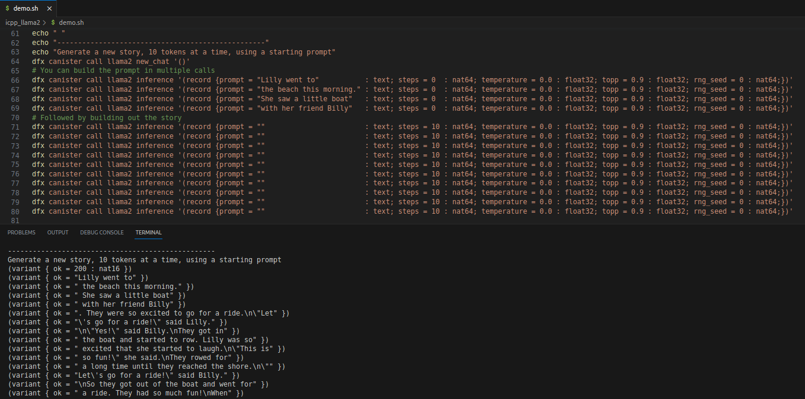

# [karpathy/llama2.c](https://github.com/karpathy/llama2.c) for the Internet Computer

# Getting Started

- Install the C++ development environment for the Internet Computer ([docs](https://docs.icpp.world/installation.html)):
  - Create a python environment. (We like MiniConda, but use whatever you like!)
    ```bash
    conda create --name myllama2 python=3.11
    conda activate myllama2 
    ```
  - Clone this repo and enter the icpp_llama2 folder
    ```bash
    git clone https://github.com/icppWorld/icpp_llm.git
    cd icpp_llm/icpp_llama2
    ```
  - Install the required python packages *(icpp-pro & ic-py)*:
    ```bash
    pip install -r requirements.txt
    ```
  - Install the [wasi-sdk](https://github.com/WebAssembly/wasi-sdk) compiler:
    ```bash
    icpp install-wasi-sdk
    ```
  - Install dfx:
    ```bash
    sh -ci "$(curl -fsSL https://internetcomputer.org/install.sh)"
    
    # Configure your shell
    source "$HOME/.local/share/dfx/env"
    ```
    *(Note: On Windows, just install dfx in wsl, and icpp-pro in PowerShell will know where to find it. )*
  
- Deploy the smallest pre-trained model to canister `llama2_260K`:
  - Start the local network:
    ```bash
    dfx start --clean
    ```
  - Compile & link to WebAssembly (wasm), as defined in `icpp.toml`:
    ```bash
    icpp build-wasm
    ```
  - Deploy the wasm to a canister on the local network:
    ```bash
    $ dfx deploy llama2_260K
    ```
  - Check the health endpoint of the `llama2_260K` canister:
    ```bash
    $ dfx canister call llama2_260K health
    ```
  - Upload the 260k parameter model & tokenizer:
    ```bash
    python -m scripts.upload --network local --canister llama2_260K --model stories260K/stories260K.bin --tokenizer stories260K/tok512.bin
    ```
  - Check the readiness endpoint, indicating it can be used for inference:
    ```bash
    dfx canister call llama2_260K ready
    ```

- Test it with dfx:  
  - Generate a new story, 10 tokens at a time, starting with an empty prompt:
    ```bash
    dfx canister call llama2_260K new_chat '()'
    dfx canister call llama2_260K inference '(record {prompt = "" : text; steps = 10 : nat64; temperature = 0.9 : float32; topp = 0.9 : float32; rng_seed = 0 : nat64;})'
    dfx canister call llama2_260K inference '(record {prompt = "" : text; steps = 10 : nat64; temperature = 0.9 : float32; topp = 0.9 : float32; rng_seed = 0 : nat64;})'
    # etc.
    ```
  - Generate a new story, starting with a non-empty:
    ```bash
    dfx canister call llama2_260K new_chat '()'
    dfx canister call llama2_260K inference '(record {prompt = "Jenny climbed in a tree" : text; steps = 10 : nat64; temperature = 0.9 : float32; topp = 0.9 : float32; rng_seed = 0 : nat64;})'
    dfx canister call llama2_260K inference '(record {prompt = "" : text; steps = 10 : nat64; temperature = 0.9 : float32; topp = 0.9 : float32; rng_seed = 0 : nat64;})'
    # etc.
    ```

# Next steps

As you test the smallest pre-trained model, llama2_260K, you quickly realize that it is not a very good model. The stories generated are not comprehensible. This is simply because the model is not large enough. It is just for verifying that your build, deploy and test pipeline is functional.

You also will notice that using dfx to generate stories is not very user friendly. We build a little frontend to generate stories, available as an open source project: https://github.com/icppWorld/icgpt, and deployed to the IC as deployed as [ICGPT](https://icgpt.icpp.world/).

As next challenges, some ideas:
- Deploy the 15M parameter model
- Test out the 15M model at [ICGPT](https://icgpt.icpp.world/)
- Test the influence of `temperature` and `topp` on the storie generation
- Build your own frontend
- Train your own model and deploy it
- Study the efficiency of the LLM, and look for improvements
- etc.

Some further instructions are provided below.

## Deploy the 15M parameter pre-trained model

- You can get other model checkpoints, as explained in [karpathy/llama2.c](https://github.com/karpathy/llama2.c):

   For example, this command downloads the 15M parameter model that was trained on the TinyStories dataset (~60MB download) and stores it in a `models` folder:

   ```bash
   # on Linux/Mac
   mkdir -p models
   wget -P models https://huggingface.co/karpathy/tinyllamas/resolve/main/stories15M.bin
   ```

   ```powershell
   # in Windows PowerShell (Miniconda recommended)
   if (-not (Test-Path -Path .\models)) {
    New-Item -Path .\models -ItemType Directory
   }
   Invoke-WebRequest -Uri https://huggingface.co/karpathy/tinyllamas/resolve/main/stories15M.bin -OutFile .\models\stories15M.bin
   ```

- The *demo* script starts the local network, deploys llama2, uploads the model & tokenizer, and generates two stories:
  - `./demo.sh`  , on Linux / Mac
  - `.\demo.ps1` , in Windows PowerShell (Miniconda recommended)

​        This screenshot shows the generation of the second story:




# Fine tuning

  When making your own checkpoint via fine-tuning, make sure to train with the correct version of [karpathy/llama2.c](https://github.com/karpathy/llama2.c):

  | release | commit sha                                |
  | --------| ----------------------------------------- |
  | 0.1.0   |  b28c1e26c5ab5660267633e1bdc910a43b7255bf |
  | 0.2.0   |  57bf0e9ee4bbd61c98c4ad204b72f2b8881ac8cd |
  | 0.3.0   |  b9fb86169f56bd787bb644c62a80bbab56f8dccc |